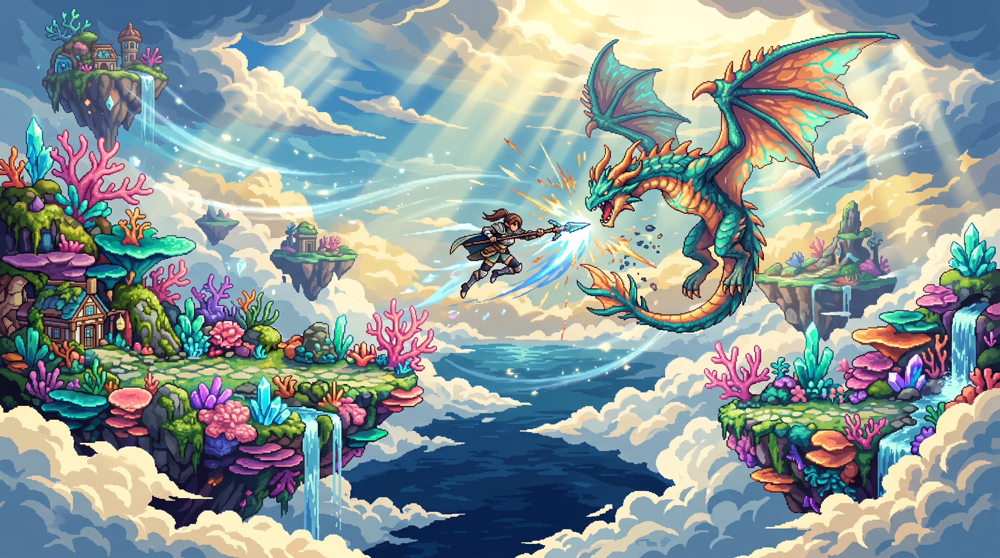
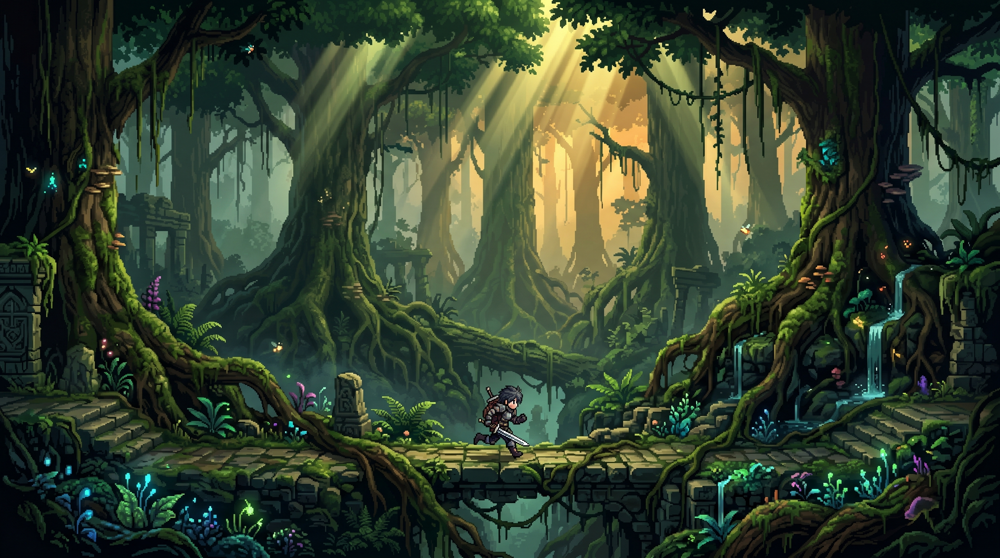
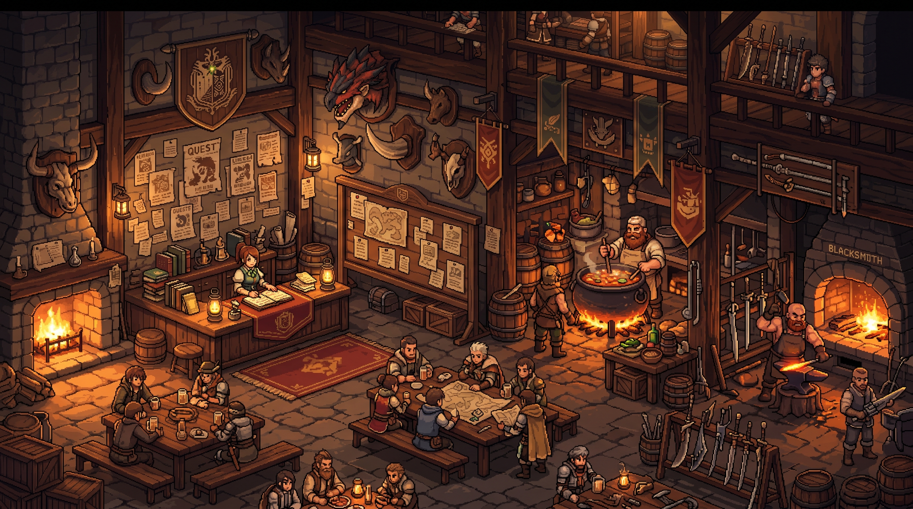
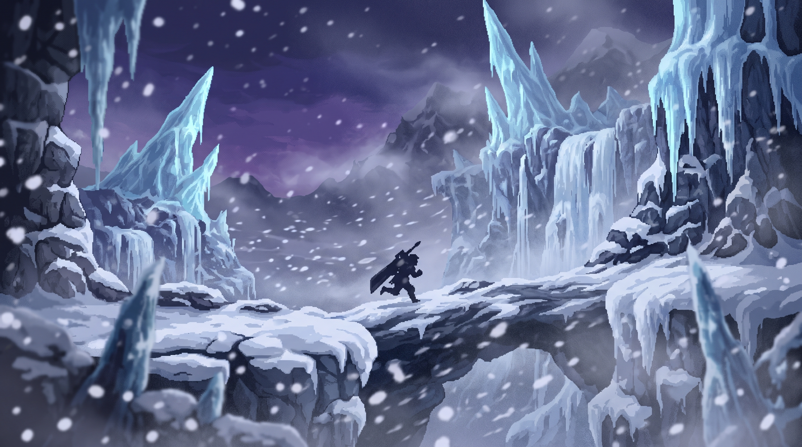
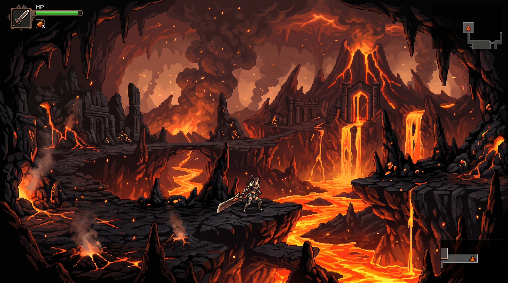
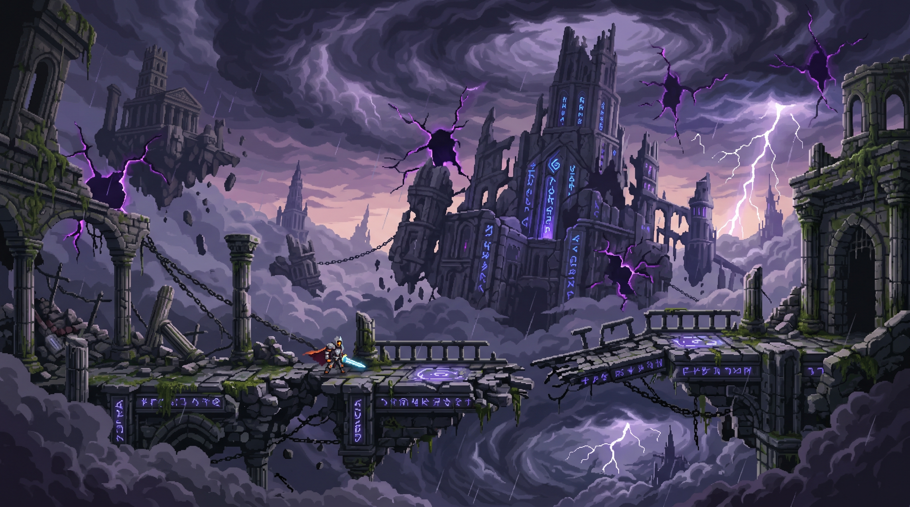
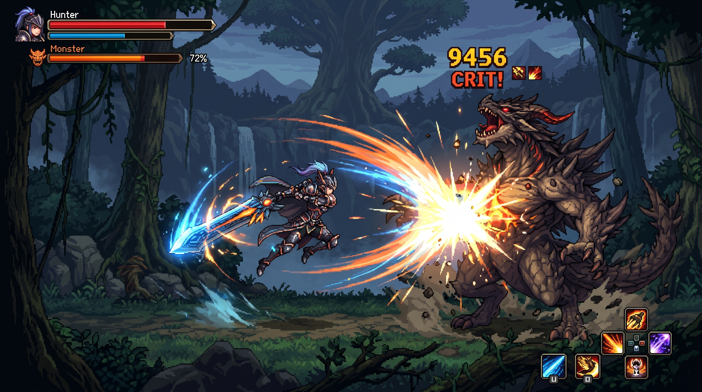
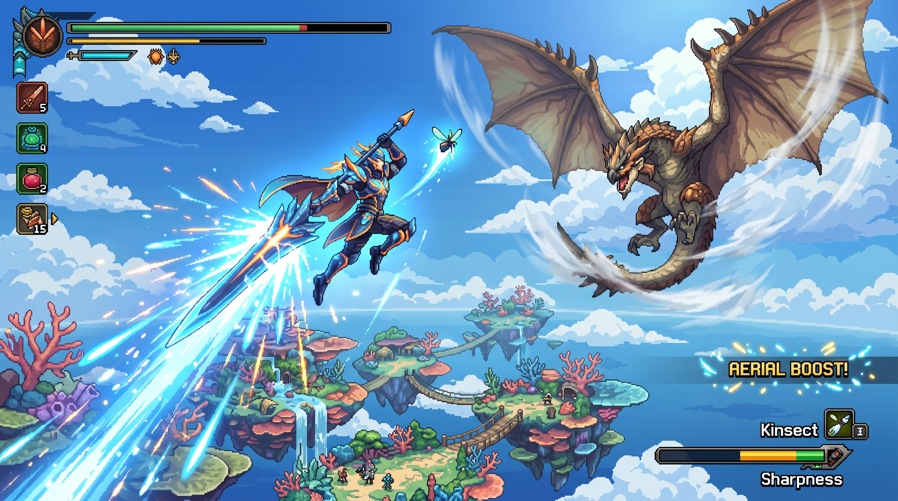
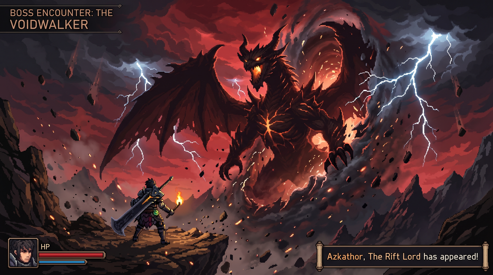

# Rift Hunter

> *"Every hunt is a story. Every biome is a frontier."*

A desktop solo ARPG inspired by Monster Hunter — 2.5D side-scrolling exploration across seven spectacular biomes, aerial combat, equipment-driven skills, crafting from monster parts, and a living guild hub where your legend grows. No skill trees. No grinding for 20 hours. Just hunting, crafting, and coming home to a town that gets better the more you do.

**[View Promo Site](https://ravellerh.github.io/rift-hunter)**

---

## Screenshots

<div align="center">
  
  
</div>
<div align="center">
  
  
</div>
<div align="center">
  
  
</div>
<div align="center">
  
  
  
</div>

---

## Concept

| Element | Design Decision |
|---|---|
| Genre | Solo ARPG |
| Platform | Desktop — Windows / Mac / Linux |
| Engine | Godot 4 (GDScript) |
| Perspective | 2.5D side-scrolling with depth layers |
| Session Style | Open-ended exploration, quest-driven |
| Core Fantasy | Hunt. Explore. Build your legend. |
| Art Style | Vibrant anime pixel art — 32px / 48px sprites |
| Story | Original IP — world of Aethara, see LORE.md |

---

## Core Game Loop

```
Guild Board → Accept Quest → Enter Biome
          → Explore & discover (gather materials, fill the Codex)
          → Fight Riftborn mid-boss (rare parts)
          → Challenge Elder Veilborn boss (unique parts + first-kill trophy)
          → Return to Veilwatch
          → Craft & upgrade gear (new skills unlock from new armor)
          → Guild hall grows, NPCs react, relationships deepen
          → Unlock next biome → repeat
```

---

## Key Features

- **Equipment-driven skills** — no skill tree. Your armor and weapon define your abilities. Stacking the same skill across pieces levels it up.
- **Six weapon types** — Sword & Shield, Great Sword, Dual Blades, Bow, Insect Glaive, Lance. Each has a distinct moveset and passive skill.
- **Aerial combat** — flying monsters pull you into a sky combat layer. Insect Glaive players live up there. Bow players thrive. Lance players find it character-building.
- **Monster intro sequences** — first encounter with any monster triggers a cinematic pan, roar, and music shift. Every boss arrival feels earned.
- **Light grind design** — 3 to 5 hunts for a full gear set. Every hunt gives something useful.
- **Living Guild hub** — six guilds, each with personality and a growing hall. Named NPCs with friendship arcs, a meal system, a quest board, and seasonal events that keep the calendar alive.

---

## Biomes

| # | Biome | Guild Rank | Boss |
|---|---|---|---|
| 1 | Ancient Canopy | G1 | Verdanthos — ancient serpentine Elder, controls the canopy |
| 2 | Wildspire Waste | G1 | Diablorak — burrowing horned Elder, charges from underground |
| 3 | Frosted Peaks | G2 | Velkhrath — colossal mammoth Elder, brings the blizzard with it |
| 4 | Coral Skyland | G2 | Namielle-Keth — bioluminescent flying Elder, floods platforms, arcs lightning |
| 5 | Volcanic Abyss | G3 | Ashmaul — largest documented living Veilborn, story-critical |
| 6 | Rotten Hollow | G3 | Chaoskrel — long-dormant deep Elder, never before documented |
| 7 | Elder Sky Ruins | G4 | Serath + The Sovereign — Sky Kingdom, a Rift Lord, and one big decision |

---

## Story (No Spoilers)

You've arrived at **Veilwatch** — a frontier town where six hunter guilds compete loudly, the biomes are still being mapped, and the **Field Codex** gains new entries every season. Pick a guild. They'll give you a bunk, a quest board, and a genuinely warm welcome.

The world of **Aethara** is spectacular. Ancient forests, floating coral islands, volcanic calderas, underground bioluminescent caverns. Creatures called **Veilborn** carved out territories here three centuries ago and haven't left. Most of the time, that's fine. The Guild exists to make sure it stays fine.

Something's been disrupting the stable zones. The case takes you up through every biome — and eventually, to ruins floating above the clouds that have been silent for three hundred years.

Full lore, world history, and story acts in **LORE.md**.

---

## Quick Start — First Claude Code Session

```
I'm building a 2.5D solo ARPG in Godot 4 called Rift Hunter.
Use GDScript for all scripts. Read ARCHITECTURE.md and DESIGN.md first.

The game has:
- 2.5D side-scrolling with depth layers (z_index, YSort)
- Ground combat and a separate aerial combat plane
- Equipment-driven skill system (no skill tree)
- Crafting from monster parts
- 7 biomes gated by Guild rank
- Guild hub at Veilwatch with named NPCs and guild hall progression

Start with:
1. Player scene — WASD movement, jump, basic sword attack, dodge roll with i-frames
2. Camera follow with smoothing and slight lookahead in movement direction
3. constants.gd autoload — GRAVITY, MOVE_SPEED, JUMP_FORCE, DODGE_DURATION, IFRAME_DURATION

Keep each system in its own script. Follow the structure in ARCHITECTURE.md.
```

---

## Documentation

| File | Contents |
|---|---|
| `ARCHITECTURE.md` | Godot 4 setup, file structure, sprite strategy, AI agent workflow |
| `DESIGN.md` | Player stats, weapon types, skill system, biomes, combat, monsters, crafting, Guild hub, friendship system, seasonal events |
| `LORE.md` | World of Aethara, the Great Sundering, Veilborn tiers, six guilds, full story acts |
| `ROADMAP.md` | 7 development phases with task checklists, open design questions |
| `GAMEPLAN.md` | Godot resource schemas, system APIs, signal list — AI coding agent reference |
| `PROMPTS.md` | AI art generation prompts for all characters, monsters, and NPCs |

---

*Rift Hunter — Design v2.0 — May 2026*
